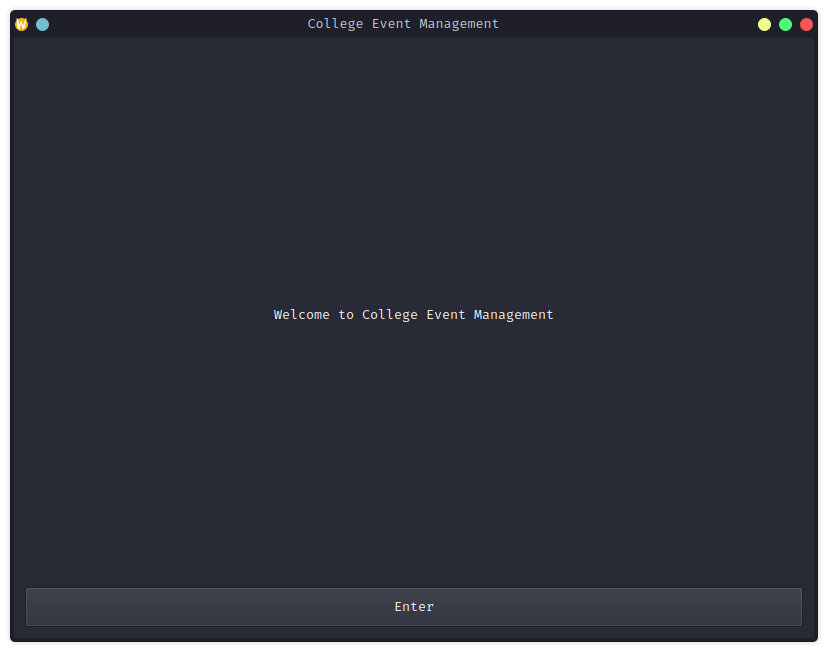
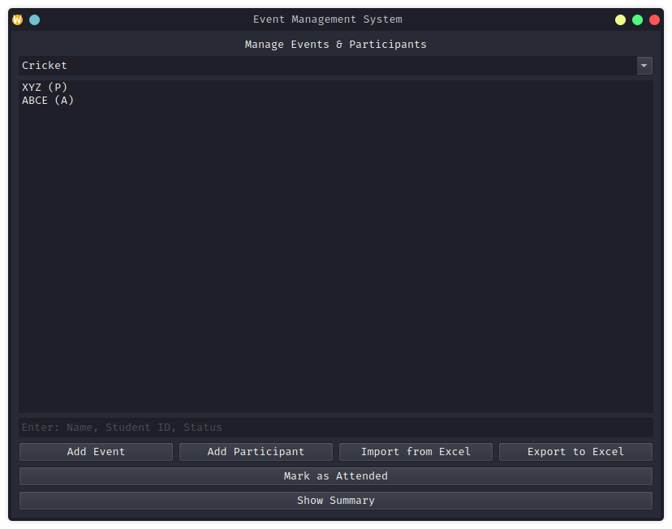

# College Event Management System

This is a College Event Management System built using PySide6 for the GUI and pandas for handling Excel files. The system allows users to manage events and participants, import participant data from Excel files, and mark attendance.

## Features

- **Event Management**: Add and manage events.
- **Participant Management**: Add participants to events with details such as name, contact, department, and status.
- **Import from Excel**: Import participant data from Excel files.
- **Attendance Marking**: Mark participants as attended.
- **Summary**: View a summary of total participants in each event.

## Screenshots

### Start Screen


### Main Screen



## Requirements

- Python 3.6+
- PySide6==6.3.1
- pandas==1.3.3
- openpyxl==3.0.9

## Installation

1. Clone the repository:
    ```sh
    git clone https://github.com/Princelad/Event_management.git
    cd Event_management
    ```

2. Install the required packages:
    ```sh
    pip install -r requirements.txt
    ```

## Usage

1. Run the application:
    ```sh
    python src/main.py
    ```

2. The start screen will appear. Click "Enter" to go to the main event management window.

3. In the main window, you can:
    - Add events and participants.
    - Import participant data from an Excel file.
    - Mark participants as attended.
    - View a summary of total participants in each event.

## Project Structure

- [main.py](http://_vscodecontentref_/1): Entry point of the application.
- [event_manager.py](http://_vscodecontentref_/2): Contains the [EventManager](http://_vscodecontentref_/3) class for managing events and participants.
- [start_screen.py](http://_vscodecontentref_/4): Contains the [StartMenu](http://_vscodecontentref_/5) class for the start screen.
- [main_screen.py](http://_vscodecontentref_/6): Contains the [MainWindow](http://_vscodecontentref_/7) class for the main event management window.

## License

This project is licensed under the MIT License. See the [LICENSE](http://_vscodecontentref_/8) file for details.
